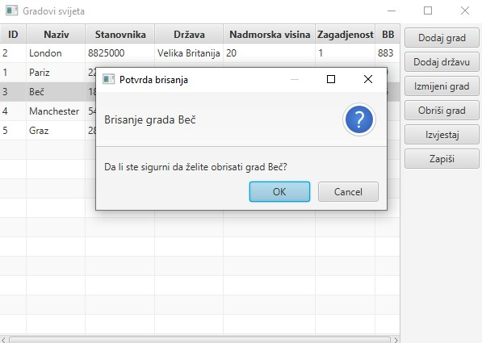

# RPR_druga_parcijala
Mini JAVAFX projekat "Države i gradovi" urađen u toku slušanja predmeta Razvoj programskih rješenja na Elektrotehničkom fakultetu u Sarajevu.

## Pokretanje

Da bismo pokrenuli aplikaciju potrebno je podesiti JDK i JAVAFX. Projekat je rađen u verziji 13.0.1 pa se preporučuje da se te verzije i instaliraju. Klonirati aplikaciju i pokrenuti je iz Main.java. Preporučeno okruženje je IntelliJ IDEA.

### JDK

Podesiti JDK u ```File -> Project Structure -> Project```. JDK je najčešće u ```User/Program Files/Java/jdk-[version]```.

### JAVAFX

Dodati novu Java biblioteku u ```File -> Project Structure -> Libraries```. Biblioteka je najčešće u ```User/Program Files/JavaFX/javafx-sdk-[version]/lib```.

### Napomena

Možda će biti potrebno dodati VM opcije u ```Run -> Edit Configurations ...```

VM options: ```--module-path "\path\to\javafx-sdk-[version]\lib" --add-modules javafx.controls,javafx.fxml```

### Screenshots

#### Glavni interface


#### Dodavanje grada


#### Editovanje grada


#### Dodavanje države


#### Brisanje grada



#### Prikaz izvještaja


